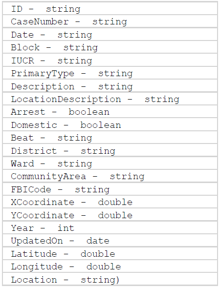
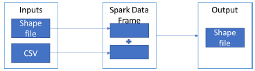
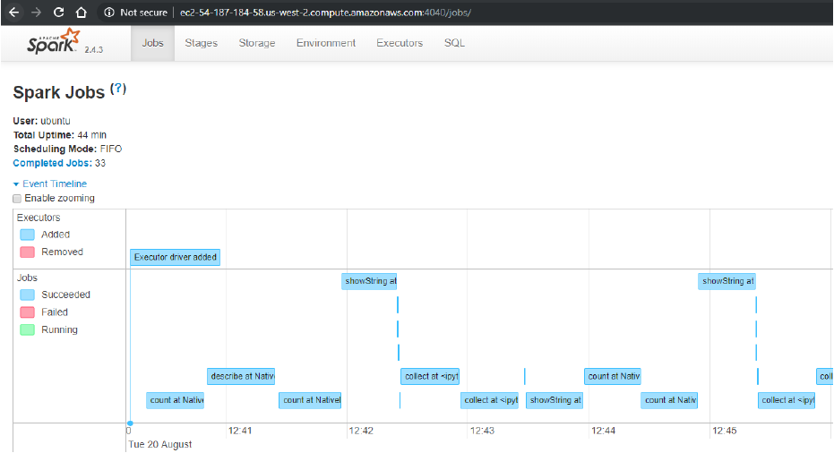
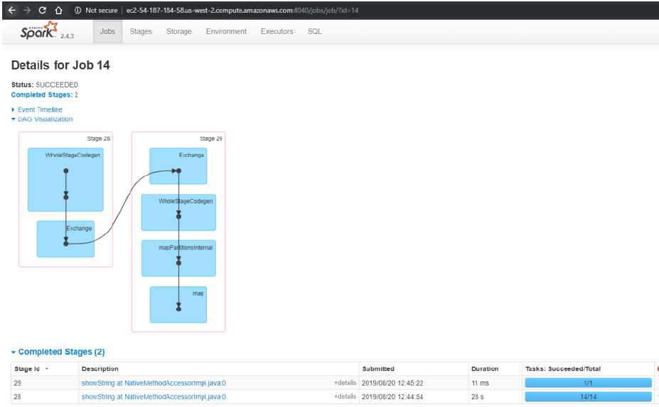
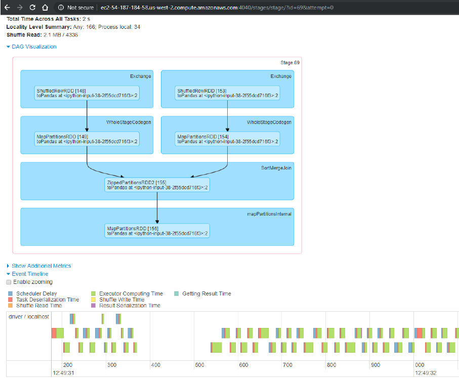

# Chicago-crimes-pyspark
## 1. Introduction
The deluge of data combined with new technologies and analysis techniques, has the potential to inform decision and policy making in unprecedented ways. Governments increasingly generating large-scale data sets on a range of topics, including climate change, geospatial data, traffic patterns, health and disease data, purchasing behavior, and social behavior through social media interactions.
This large-scale data in the era of geographic information systems (GIS) cause new challenges: discerning how to analyze and process the geospatial big data, how the spatial big data can be clustered, distributed, stored, indexed, and managed, and how this data can be computed or visualized in the system with high performance. In this project I use spark to analyze Chicago crimes dataset.
## 2. Goals
Visualize Chicago crimes Geo data over a geographic map.
Data analysis and visualization using spark.
## 3. Data
In this project I use the Chicago crimes dataset. This data reflects reported incidents of crime (except for murders where data exists for each victim) that occurred in the City of Chicago from 2001 to present, minus the recent seven days. Data is extracted from the Chicago Police Department's CLEAR (Citizen Law Enforcement Analysis and Reporting) system. This data contains about 7 million records with the following attributes:

In addition, I use the geometry of Chicago data. This data contains the boundaries of Chicago and stored in a shapefile (shp) format - data format for geographic information system (GIS) software.
## System architecture
I implement this project by creating Free Tier Ubuntu Server 18.04 LTS (HVM), SSD Volume Type Amazon EC2 Instances. I installed the following apps and packages on the ec2:
• Anaconda
• Jupyter Notebook
• Java
• Scala
• python library py4j
• pip
• Spark and Hadoop
• Pandas
• Matplotlib
• shapefile
• shapely
• awscli
I stored the Chicago crimes data on a s3 bucket.
## 5. Implementation
Our solution includes 3 stages:
a. Loading the data from 2 sources: csv file and shape file. And converting the data to spark data frame.
b. Analysis of the data using spark.
c. Merge the data into one data frame, convert it back to geodata frame and visualizing it.

The code as well as the execution results attached in the Jupyter notebook file - Chicago Crimes.html.
I tracked the spark during execution thru the web UI for spark shell.
The Event timeline:

Details for a specific job:

The partitions of the stage:

## 6. Summary & Conclusions
In this project I deal with geo-spatial big data. In order to analyze and visualize this data efficiently, I use spark. By doing that I parallelize the computation. Finally, I converted the data back from spark to pandas and visualize it geometrically. In this configuration I managed to successfully overcome GeoPanda disadvantages, meaning, a limited computation abilities and lack of the ability to visualize Geo data in Spark.
Even thou I built low resources Amazon EC2 instances I succeed to execute this code. In comparison, python couldn’t load the CSV file using panda and exit with error.
